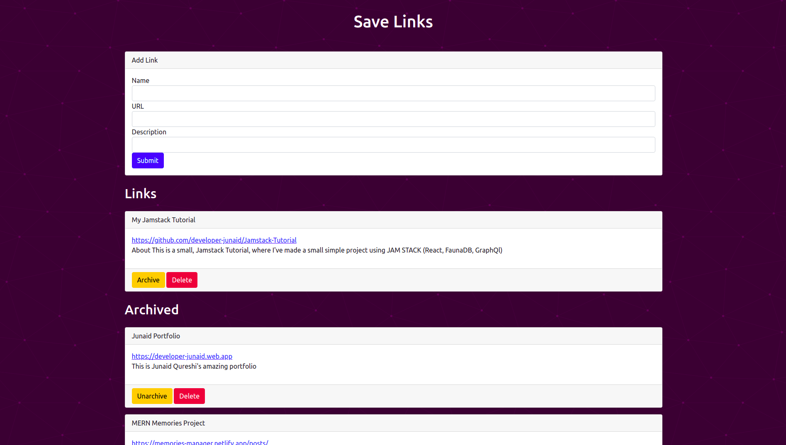

## JAMStack Tutorial

## Stack = React + GraphQl + FaunaDB

### URL: :link: https://save-links.netlify.app/



## Steps

- Signup on [Netlify](https://www.netlify.com/)
- run command `npm i -g yarn`
- run command `npm i netlify-cli -g`
- run command `npx create-react-app jamstack-tutorial`
- run commannd `cd jamstack-tutorial`
- create directory on root `functions/helloWorld.js`
- create file (netlify.toml) on root
- add commands inside (as written in netlify.toml in my repo)
- run command `netlify dev` (functions and frontend started)
- Faunadb Setup
- - Signup to [FaunaDB](https://fauna.com/)
- - create database (click create database)
- - GraphQl > import Schema (choose file functions/utils/links.gql)
- - Click Security > add key > select server > add name > save and copy
- - Create .env file at root > store the key in FAUNA_SECRET_KEY variable
- create functions
- - Create, Read, Update, Delete
- Create Frontend
- - Integrate Serverless functions with Frontend by making api calls

## Packages Installation

```bash
  npm i axios dotenv bootstrap
```


## Tech Stack 
- HTML5
- CSS3
- Javascript and ES+6
- Bootstrap
- ReactJs
- NodeJs
- Netlify Serverless Functions
- GraphQl
- FaunaDB (Database)
